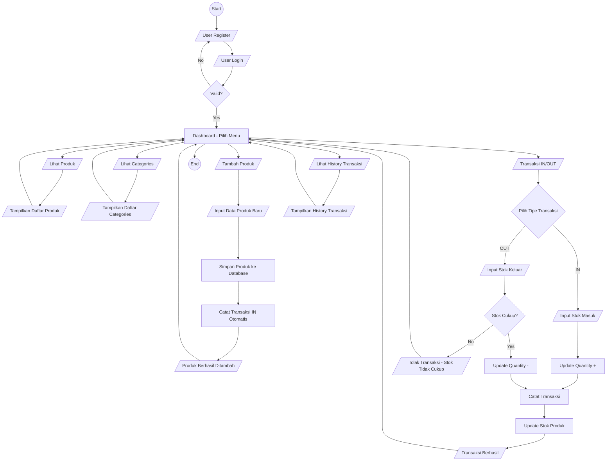

# Inventory Management System

This is a backend project built with Go, utilizing the **Gin Gonic** framework for handling HTTP requests, the **pgx** driver for database connectivity, and **PostgreSQL** as the database management system. The system is designed to manage inventory products, including user authentication, product management, category management, and transaction recording.

## User Requirements

The system is designed to meet the following user requirements:

| Requirement | Description |
|------------|-------------|
| User Authentication | Users can register with a unique email and log in to access the system securely. Login generates a JWT (JSON Web Token) for authentication. |
| Endpoint Security | Every endpoint requires JWT verification to ensure only authorized users can access it. |
| Product Management | Users can add new products and view all products. Adding a product automatically records a stock-in transaction in the transactions table. |
| Category Management | Users can view all product categories to understand the classification of products. |
| Transaction Management | Users can record product movements (Stock In and Stock Out). Stock Out transactions are validated to ensure the quantity does not exceed the available product stock. |
| Transaction History | Users can view transaction history with the following details for each transaction: <ul><li>Product Name</li><li>Category Name</li><li>Stock In Quantity</li><li>Stock Out Quantity</li><li>Purchase Price</li><li>Selling Price</li><li>Total Purchase Price (for Stock In)</li><li>Total Selling Price (for Stock Out)</li><li>Available Stock</li></ul> |
| Dashboard Access | Users can access a dashboard to navigate between viewing products, categories, adding products, recording transactions, and viewing transaction history. |

## API Endpoints

The following table lists the API endpoints for the Inventory Management System:

| Method | Endpoint                     | Description                  |
|--------|------------------------------|------------------------------|
| POST   | `/auth/register`             | Register a new user          |
| POST   | `/auth/login`                | Log in an existing user      |
| POST   | `/products`                  | Add a new product            |
| GET    | `/products`                  | Retrieve list of all products|
| GET    | `/products/categories`       | Retrieve list of all categories |
| GET    | `/transactions`              | View transaction history      |
| POST   | `/transactions`              | Record goods movement (IN/OUT) |

# Flowchart



# ERD


## Installation

1. **Clone the Repository**:
   ```bash
   git clone https://github.com/VsalCode/fgo24-final-phase-3.git
   cd fgo24-final-phase-3
   ```

2. **Install Dependencies**:
   ```bash
   go mod tidy
   ```

3. **Set Up Environment Variables**:
   Create a `.env` file in the project root and add the required environment variables (see [Environment Variables](#environment-variables)).

4. **Run the Application**:
   ```bash
   go run main.go
   ```

## Environment Variables

Create a `.env` file in the project root with the following variables:

```env
PGUSER=your_postgres_username
PGPASSWORD=your_postgres_password
PGHOST=your_postgres_host
PGPORT=your_postgres_port
PGDATABASE=your_postgres_database

SECRET_KEY=your_app_secret_key
```

## How To Contribute
Pull requests are welcome! For major changes, please open an issue first to discuss your proposed changes. 

## License
This project is licensed under the [MIT](https://opensource.org/license/mit) License