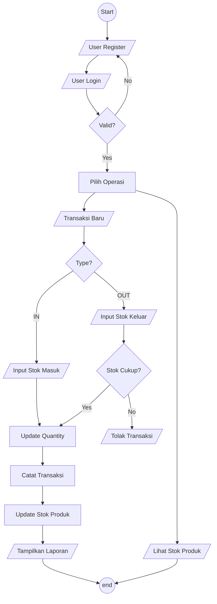
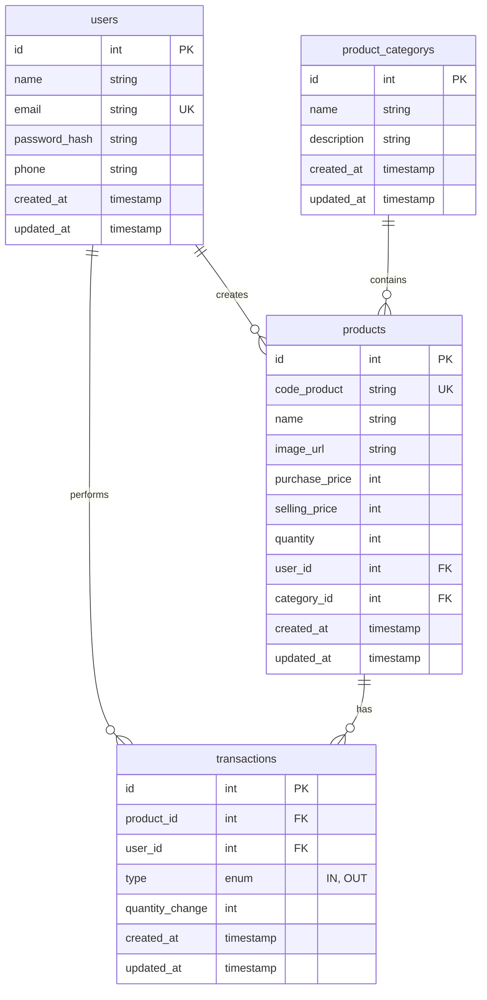

# Flowchart

```mermaid
 flowchart TD
    A((Start)) --> R[/User Register/]
    R --> B[/User Login/]
    B --> C{Valid?}
    C -->|No| R
    C -->|Yes| D[Pilih Operasi]
    D --> E[/Lihat Stok Produk/]
    D --> F[/Transaksi Baru/]
    F --> G{Type?}
    G -->|IN| H[/Input Stok Masuk/]
    G -->|OUT| I[/Input Stok Keluar/]
    H --> J[Update Quantity]
    I --> K{Stok Cukup?}
    K -->|No| L[/Tolak Transaksi/]
    K -->|Yes| J
    J --> M[Catat Transaksi]
    M --> N[Update Stok Produk]
    N --> O[/Tampilkan Laporan/]
    O --> P((end))
    E --> P
```

# ERD

```mermaid
erDiagram
    users {
        id int PK
        name string
        email string UK
        password_hash string
        phone string
        created_at timestamp
        updated_at timestamp
    }

    product_categorys {
        id int PK
        name string
        description string
        created_at timestamp
        updated_at timestamp
    }

    products {
        id int PK
        code_product string UK
        name string
        image_url string
        purchase_price int
        selling_price int
        quantity int
        user_id int FK
        category_id int FK
        created_at timestamp
        updated_at timestamp
    }

    transactions {
        id int PK
        product_id int FK
        user_id int FK
        type enum "IN, OUT"
        quantity_change int
        created_at timestamp
        updated_at timestamp
    }

    users ||--o{ products : "creates"
    product_categorys ||--o{ products : "contains"
    users ||--o{ transactions : "performs"
    products ||--o{ transactions : "has"
```