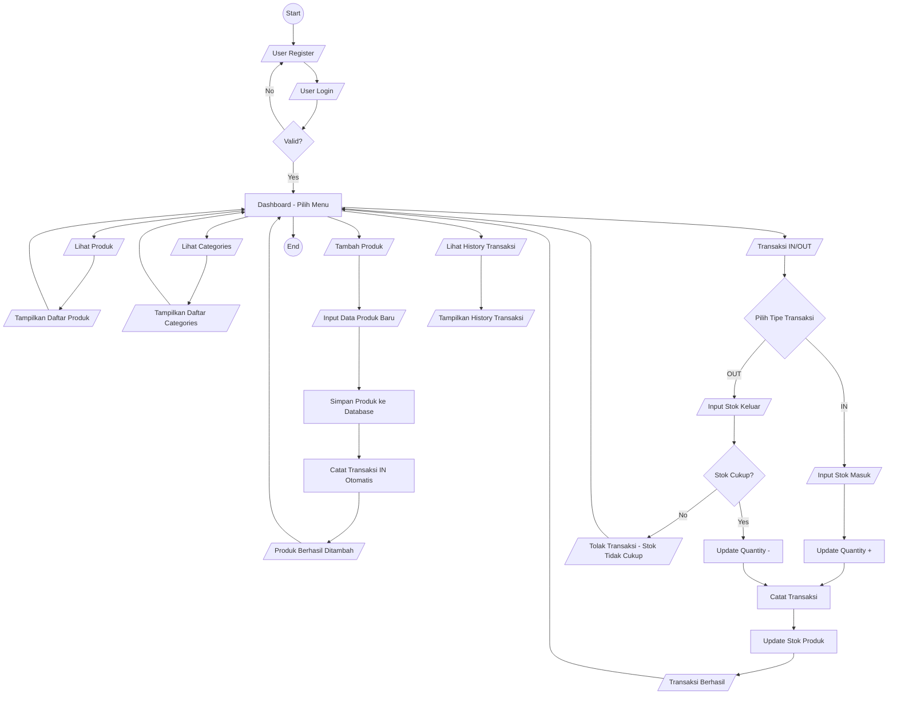

# Flowchart

```mermaid
 flowchart TD
    A((Start)) --> R[/User Register/]
    R --> B[/User Login/]
    B --> C{Valid?}
    C -->|No| R
    C -->|Yes| D[Dashboard - Pilih Menu]
    
    D --> E[/Lihat Produk/]
    D --> F[/Lihat Categories/]
    D --> G[/Tambah Produk/]
    D --> H[/Transaksi IN/OUT/]
    D --> I[/Lihat History Transaksi/]
    
    E --> E1[/Tampilkan Daftar Produk/]
    E1 --> D
    
    F --> F1[/Tampilkan Daftar Categories/]
    F1 --> D
    
    G --> G1[/Input Data Produk Baru/]
    G1 --> G2[Simpan Produk ke Database]
    G2 --> G3[Catat Transaksi IN Otomatis]
    G3 --> G4[/Produk Berhasil Ditambah/]
    G4 --> D
    
    H --> H1{Pilih Tipe Transaksi}
    H1 -->|IN| H2[/Input Stok Masuk/]
    H1 -->|OUT| H3[/Input Stok Keluar/]
    
    H2 --> H4[Update Quantity +]
    H3 --> H5{Stok Cukup?}
    H5 -->|No| H6[/Tolak Transaksi - Stok Tidak Cukup/]
    H5 -->|Yes| H7[Update Quantity -]
    
    H4 --> H8[Catat Transaksi]
    H7 --> H8
    H8 --> H9[Update Stok Produk]
    H9 --> H10[/Transaksi Berhasil/]
    H10 --> D
    H6 --> D
    
    I --> I1[/Tampilkan History Transaksi/]
    
    D --> Y((End))
```

# ERD

```mermaid
erDiagram
    users {
        id int PK
        name string
        email string UK
        password_hash string
        phone string
        created_at timestamp
        updated_at timestamp
    }

    product_categories {
        id int PK
        name string
        description string
        created_at timestamp
        updated_at timestamp
    }

    products {
        id int PK
        code_product string UK
        name string
        image_url string
        purchase_price int
        selling_price int
        quantity int
        user_id int FK
        category_id int FK
        created_at timestamp
        updated_at timestamp
    }

    transactions {
        id int PK
        product_id int FK
        user_id int FK
        type enum "IN, OUT"
        quantity_change int
        created_at timestamp
        updated_at timestamp
    }

    users ||--o{ products : "creates"
    product_categories ||--o{ products : "contains"
    users ||--o{ transactions : "performs"
    products ||--o{ transactions : "has"
```